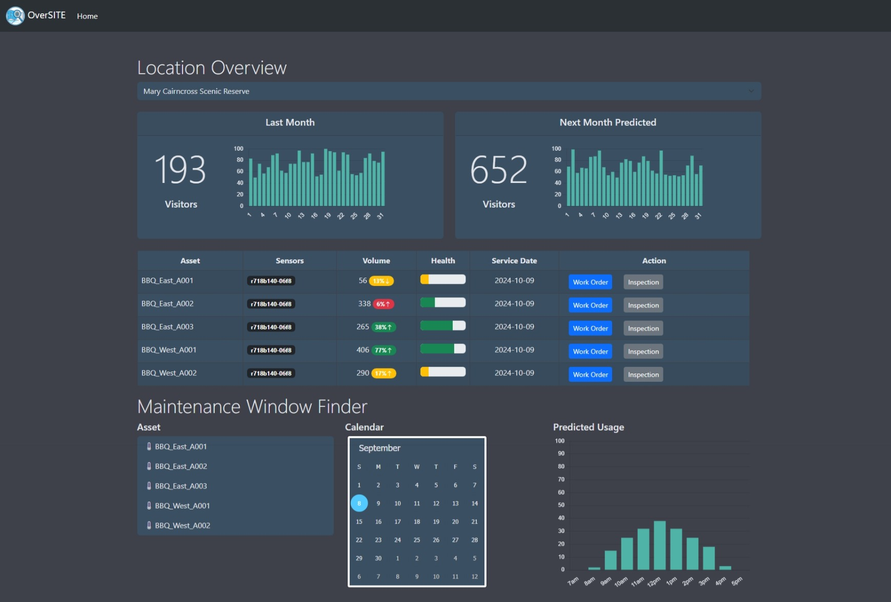

# OverSITE: Where Smart Cities Meet Smarter Decisions

## Our Team

We are a small group of IT staff working in education, with a background in computer science education, data engineering and software development, and systems, network and technical management and support.

## The Problem

Councils across Australia are increasingly seeking ways to make their cities more accessible, inclusive, and liveable. Liveability not only supports economic growth by attracting businesses and skilled workers, but it also enhances the wellbeing of residents. Key elements include safety, social cohesion, environmental sustainability, and the provision of high-quality public spaces and infrastructure.

However, as cities grow, councils face increased pressure on finances. Unplanned or uncoordinated growth and maintenance of assets can potentially threaten the liveability of urban spaces. Recent scorecards from the _Australian Urban Observatory_ show varying results across cities in key areas. Access to amenities is a significant factor in improving liveability, and maintaining these assets is equally crucial.

## Our Solution: OverSITE

To support councils in improving liveability, we propose the platform **OverSITE**, which leverages open data collected from Internet of Things (IoT) devices strategically placed across the city. These sensors measure data such as:

*   Localised weather, including rainfall
*   Passive Infrared (PIR) sensors to track foot traffic in local parks and reserves
*   Occupancy counters to monitor the usage of public buildings and facilities
*   Environmental monitoring sensors to assess air quality and temperature
*   Temperature sensors that track the usage of outdoor recreation assets, such as public barbecues

OverSITE promotes the use of historical data to predict future trends within a local government area (LGA). The platform enables data-driven decisions, optimising service delivery and enhancing asset management. By giving councils access to OverSITE, we aim to improve community engagement and maximise resource use.

## Key Features of OverSITE

OverSITE is a web-based portal that provides LGAs with the ability to select a public space, such as a local reserve. The platform lists all available assets on an easy-to-interpret dashboard, displaying historical usage based on IoT sensor data for a given period. Where OverSITE shines is in its **predictive capabilities**, offering:

*   An asset health snapshot
*   Predicted usage overviews based on data models

Asset health is predicted using available data sources and statistical models, processed through a small language model. For example, walking tracks in a reserve may collect usage data through bi-directional passive infrared counters. This data, combined with local rainfall information, can offer maintenance teams insights into which sections of the trail require attention.

By pairing usage data with weather patterns, OverSITE helps councils to maximise the use of assets, ensuring their availability when needed, while reducing unnecessary maintenance. This transforms maintenance scheduling into a **proactive** process.

OverSITE can also be leveraged to allow work orders for assets to be raised through the dashboard and would be configured to integrate and open those requests in an existing work order system. With an expansion of IoT sensors, OverSITE could be expanded to support the proactive maintenance of other assets within the council, such as gravel roads that require regular grading. With an understanding of weather patterns and usage metrics, alongside the predictive capability of OverSITE local road maintenance programmes could also be enhanced.

## Mobile App for Proactive Maintenance

The OverSITE platform extends into the field through a smartphone app, which pairs a small language model with IoT sensor data. This provides council staff with real-time data on asset conditions, enabling them to make informed, targeted decisions about proactive maintenance.

## Community-Driven Data Collection

In addition to IoT data, OverSITE supports community involvement by allowing residents to submit photos and reports via text message. This crowdsourced data helps refine the platform's predictive models and optimises service delivery by providing a more comprehensive view of asset conditions.

## Conclusion

OverSITE is a platform designed to support Australian councils in creating more liveable cities by using IoT data to inform decision-making, enhance community engagement, and streamline maintenance operations. By providing actionable insights through both sensor data and community reports, OverSITE ensures that public assets are maintained effectively, contributing to the overall liveability of urban spaces across Australia.

# Screenshots
